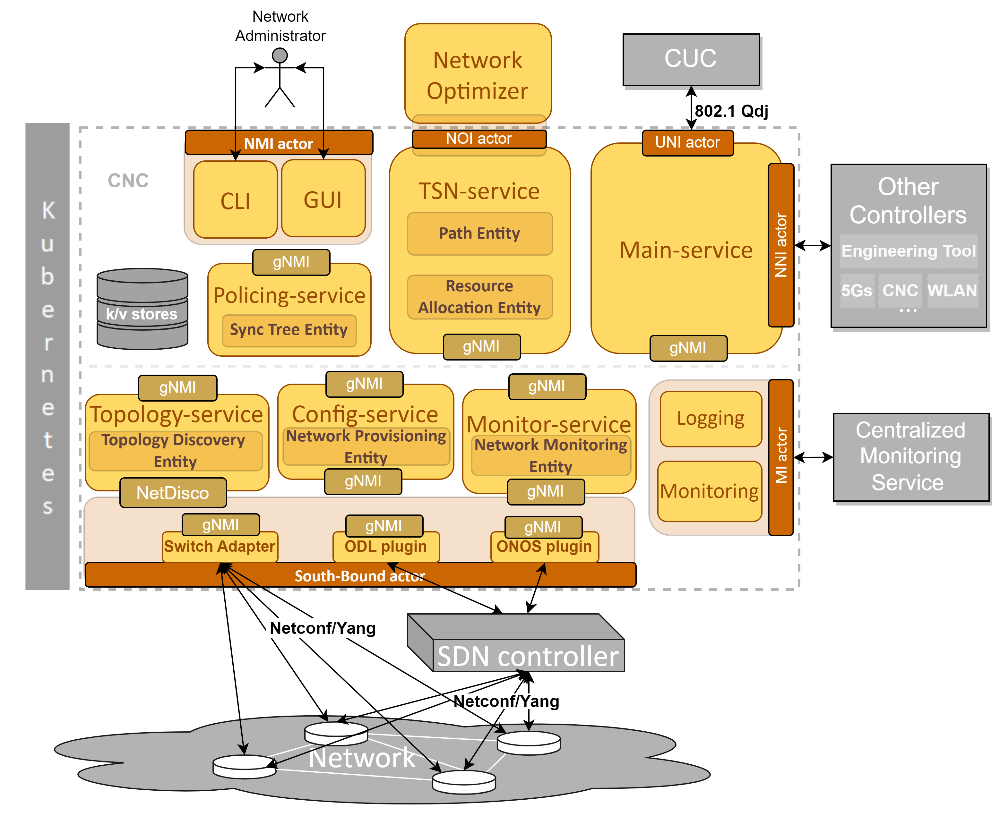
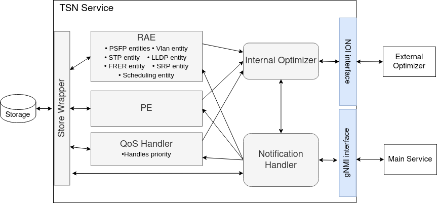
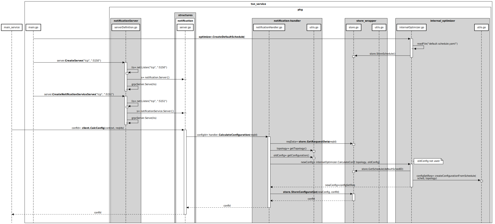

This repository is a microservice of the tool OpenCNC. OpenCNC is a unit that automatically manages the elements of a Time Sensitive Network (TSN) according to the specification presented in the IEEE 801.2Q standard and its relevant amendments.

For more information about OpenCNC, Links to the rest of its microservices as well the deployment script, please visit the repository [OpenCNC_demo: https://git.cs.kau.se/hamzchah/opencnc_demo.](https://git.cs.kau.se/hamzchah/opencnc_demo)

# Brief introduction of OpenCNC

OpenCNC is an implementation of the Control plane for TSN networks that orchestrates and manages the operations in the forwarding plane. The term management entails more than configuring
the network. It includes:
* Calculating the configuration of the TSN switches and the end stations.
* Loading and retrieving the configuration to/from the TSN switches automatically depending on the current state and target state of the network.
* Discovering the switches and retrieving their capabilities.
* Maintaining a global view of the topology and the available resources.
* Handling network events in order to maintain a desired state.
* Monitoring of performance key values for network analysis.

OpenCNC is designed as a micro-service based system. In total, it has the following micro-services, each micro-service is implemented in a different repository to allow easier use, extension and maintenance of the tool:
* Main service
* TSN service (current repository)
* policing service (not implemented yet)
* Monitoring interface
* Monitor service
* Topology service
* Config service
* gnmi to Netconf adapter
* Onos plugin (not implemented yet)

an overview of the OpenCNC target architecture is presented in the following Figure:

# TSN-service
The TSN-service is responsible for engineering the forwarding plane and managing the networking resources through establishing the network configuration. The main functionalities of this service are:

* Scheduling
* QoS handling
* Stream priority management
* Forwarding process management (e.g. routing calculation)
* Plans the reconfiguration process (the transitions of configuration between a current state and a target state) in order to avoid performance drops
* Coordinate the operations between the network optimizer, configuration and reconfiguration entities

## Reference design of the tsn service
The target design of the tsn service is depicted in the following figure: 

The core packages of the tsn service are the PE(Path Entity), the RAE(Resource Allocation Entity) and the QoS handler. Each package represents an independent functional block that manages one part of the network configuration. The RAE in the current design includes the functions managing the PSFP, Vlan, STP, LLDP, SRP and FRER. Another important functionality of the RAE is the network scheduling which manages the shaping configuration. The PE is the entity responsible for the forwarding process management including routing. The QoS Handler manages for the current design the priority configuration in the switches. Another important element of the tsn service is the optimizer. It has two main functionalities, the first is to coordinate the optimization requests with the external optimizer where the actual optimization is performed. The second is a fallback mechanism that is used in case the external optimizer is not reachable, or not configured. The fallback mechanism applies a default configuration that is generic enough to support many use cases, although, it wouldn't necessarily be optimal.

The rest of the packages (i.e. notification handler, store wrapper, etc) are used to convey and manage the processes within the tsn service, including storing/retrieving configuration, retrieving topology and streams information, handling the configuration requests from the main service, etc.

Tsn service communicates with the external optimizer through the Network Optimization interface. In the current design the interface offers the possibility to register an optimizer and the possibility to call a known optimizer for optimization. The following options enable those two operations:
* get_capabilities: the NOI responds to the get_capabilities request with a list of options. Each option defines an operation that the opencnc recognizes and needs (e.g. scheduling, routing, application placement, GCL quality assessment, configuration validation, etc). The response of the NOI also includes textual description of the option as well as the input and the output formats that the optimizer treating each option should respect.
* register_solver: upon receiving the list of options, an optimizer can register under the most appropriate one  by specifying its IP, port, is it synchronous or asynchronous, and its maximum response time as well as the options it provides.
* optimize: opencnc uses this function to call a known optimizer to perform the intended operation.

## Implementation state
the following sequence diagram summarizes the current state of implementation. Only the main functions are presented.

.

The sequence diagram presents only the packages that are involved in one of the implemented processes. Nevertheless, more functions and packages (representing modules or sub-modules of the reference design) are present in the code.

It is to note that the gNMI interface defined in the target design between the main service and the notification handler is implemented using more than one package. Namely, the package "structures" contains one part of its definition and the package "notificationServer" contains another part as shown in the sequence diagram.

The RAE, PE and the QoS Handler are mission in the sequence diagram since their implementation is not finished yet.

## TODO

### Namespace
One needs to get the namespace from the gnmi-netconf-adapter (which is not implemented), to replace the whole namespace when performing an update, as described in chapter 3.5.4 in DE-IP Solution (D-DE-IP-G-11-026) version 1.2.0.

### Send new configuration to the configuration-service (RAE)
After having the namespace from the adapter, the updated configuration needs to be sent to the configuration-service, which will apply it to the switches and send a notification if it could use the configuration.

### Send accepted configuration to k/v-store (RAE)
After getting an ok notification from the configuration-service, one should send it to the k/v-store.

### Proper testing of the configuration (RAE)
When the configuration can be applied to the system, it should be properly tested. Does it configure the system as desired?

### Expansion of the configuration (RAE)
RAE needs to be expanded to be able to configure everything that needs to be configured for TSN to work.

### Expanded RAS notification (RAE)
The gRPC protocol buffer for the communication to RAE needs to be expanded to support requests for all configurations that should be able to be set. It needs to be expanded at both TSN service and main service.

### Configuration model (RAE)
To be able to expand the configuration, the adapter's data model does most likely need to be expanded.

### notificationService (Monitor service)
Must conform with grpc notification messages defined in the .proto file in the same folder. It is at writing not yet decided how the message show be formatted and what data should be passed between Monitor service event and this notification service. This must be agreed on.

## Problems

### Configuration service (RAE)
To push a new configuration to the configuration service, it needs to have the keys for the whole subtree that one makes a change to. But the information that is gathered from the k/v-store does not provide it directly. Therefore, it probably needs to be developed a way to gather the keys from the data model, which is where they are defined.

### Sync multiple updates (RAE)
Each Table that needs to be updated, and to make it modular, there will be separate requests. But to prevent conflicts between the different updates, they will need to be synchronized between each other. So that they do not interfere with each other.

## More information about the existing modules

### RAE (Resource Allocation Entity)
This directory is for creating new configuration,which can be applied to the switches

#### /dataStructures
Help functions to traverse the provided configuration format, to get where one needs to set values.

##### /dataStructures/Composit
Functions to get both schema tree and pb.update format when traversing the configuration

##### /dataStructures/pbMethods
This package is for help functions for the use of the packages _pb "github.com/openconfig/gnmi/proto/gnmi". Both to traverse an update configuration, get its data format, and generate new updates.

##### /dataStructures/SchemaTreeMethods
Help functions to generate schema trees, used to update the configuration at the k/v-store, and traverse schema trees

#### /MSTP
This is to initiate values in all tables that are required for Multiple spanning tree protocol (MSTP).

##### Public functions

Four tables are used for MSTP:
1. MSTP Port Table (see mstpPortTable.go)
2. MSTP CIST Table (see mstpCistTable.go)
3. MSTP CIST Port Table (see mstpCistPortTable.go)
4. MSTP Configuration Identifier Table (mstpConfigIdTable.go)
5. MSTP FID to MSTI Table (mstpFidToMstiV2Table.go)

##### References
* Requirement from
    * AVnu 4.6.4
* Description of MSTP
    * IEEE 802.1Q-2018 13.5, 13.8-13.12, 13.14, 13.24, 14
* Overview of tables used by MSTP
    * IEEE 802.1Q-2018 17.2.6

##### mstp.go
Holds the public functions to configure the MSTP tables.

UpdateMstpPortTable(priority int, pathCost int, componentId uint, port uint, mstid uint, deviceIp string) error

Updates the configuration of the MSTP port table with the provided input

##### mstpCistPortTable.go
The private functions to update the values in the CIST port table

##### mstpCistTable.go
The private functions to update the values in the CIST table

##### mstpConfigTable.go
The private functions to update the values in the configuration table

##### mstpPortTable.go
The private functions to update the values in the port table

##### mstpTable.go
The private functions to update the values in the MSTP table

##### mstpFidToMstiV2Table.go
The private functions to update the values in the FID to MSTI V2 table

#### /PCP
This is to initiate all tables that are required for Priority Code Point (PCP) mapping to traffic classes

Four tables are used for PCP:
1. PCP encoding table
2. PCP decoding table
3. Traffic class table
4. Priority regeneration table

##### References
* PCP encoding and decoding
    * IEEE 802.1Q-2018 6.9.3
* Regenerating priority
    * IEEE 802.1Q-2018 6.9.4
    * IEEE 802.1Q-2018 6.11.4
* Drop eligibility location
    * IEEE 802.1Q-2018 I.7-8
* Traffic class
    * IEEE 802.1Q-2018 8.6.6
* Traffic type
    * IEEE 802.1Q-2018 I.4

##### pcp.go
This holds the functions to generate the configuration for the tables.

##### util.go
This is to set each entry of PCP tables

#### /PSFP
To generate the tables needed for Per-Stream Filtering and Policing (PSFP)

Four tables are used for PSFP:
1. Flow meter instance table
2. Stream filter instance table
3. Stream gate instance table
4. Stream identification table

Each of them has a folder for themselves with their respective functions(flowMeterInst, streamFilterInst, streamGateInst and streamIdTable).

##### References
* Requirement from
    * IEEE802.1QCC-2018 46.1.3.3
* Configuration structure
    * ieee802-dot1CB.yang
* Theory
    * IEEE 802.1CB-2017 6
    * IEEE 802.1Q-2018 8.6.5-8.6.6
* Managed objects
    * IEEE 802.1Q-2018 12.29
    * IEEE 802.1Q-2018 12.31
    * IEEE 802.1CB-2017 9.1
* Managed objects for flow meter instance
    * [MEF wiki](https://wiki.mef.net/display/CESG/Bandwidth+Profile)

##### /streamIdTable/struct.go
defines the structs that are used as an input, because the stream identification table has tables inside of it

###### StreamHandles
Entries for each stream handle, which also includes null stream identification entries, source mac identification entries and active destination mac identification entries.

###### NullStreamIdEntry
The null stream identification entries

###### SourceMacIdEntry
The source mac identification entries

###### ActiveDestMacIdEntry
The  active destination mac identification entries

### /StreamReservation

##### References
* MRP External control: IEEE802-1Qcc-2018: 12.32.4
* MRP External control attributes: IEEE802-1Qcc-2018 Table 12-41
* MIB Module: IEEE802.1Qcc-2018 17.7.25

#### streamReservation.go
Set all values in the MSRP MRP External Control Table
! Note: this feature is not finished

### /VLAN
To set the manged objects need to use vlan

#### References
* Managed objects for VLAN are described in IEEE802.1Q-2018 12.10
* Enhanced Internal Syblayer service (acceptable frame types and PVID): IEEE802.1Q-2018 6.9
* Ingress filtering IEEE802.1Q-2018: 8.6.2
* Administrative control (restrictedVlan parameter): IEEE802.1Q-2018 11.2.3.2.3
* Managed object for Static VLAN Registration Entries in IEEE802.1Q-2018 12.7.5
* Static VLAN Registration IEEE802.1Q-2018 8.8.2

#### vlanBridgeConfiguration.go
A function “SetBridgeVlanConfiguration” is used to configure various parameters for the VLAN configuration on a Bridge. The default values for this function can be set using “SetDefaultBridgeVlanConfiguration”.

#### vlanConfiguration.go
A function “SetVlanConfiguration” is used to configure the name of a VLAN for a VID for a VLAN configuration on a Bridge.

#### staticVlanRegistrationEntry.go
A static VLAN entry can be set using the "SetStaticVlanRegistrationEntry" function.

### gRPC (pkg/structures)
pkg/structure defines the gRPC protocol buffer structures that is used by this micro service. It can be read more about at the official [gRPC manual](https://developers.google.com/protocol-buffers/docs/gotutorial).

#### Make changes to the proto files
To communicate between the micro services, one needs to implement the interfaces with proto files under /configuration. The proto file needs to be identical between the services that will communicate with each other, and every time a change is done on the proto file, it needs to be recompiled.

#### Installation for proto
On every device, install the following packages for grpc go [source](https://grpc.io/docs/languages/go/quickstart/#prerequisites):

`$ go install google.golang.org/protobuf/cmd/protoc-gen-go@v1.28`

`$ go install google.golang.org/grpc/cmd/protoc-gen-go-grpc@v1.2`

#### Setup proto
On every service that will communicate with the proto files, set the PATH

`$ export PATH="$PATH:$(go env GOPATH)/bin"`

#### Compile Proto
Each time a change is done on the proto file, recompile it, in the folder where the proto file is located:

`$ protoc --go_out=. --go-grpc_out=. --go_opt=paths=source_relative --go-grpc_opt=paths=source_relative filename.proto`

If one do only want to compile the structures:

`$ protoc --go_out=. --go_opt=paths=source_relative filename.proto`

##### /notification
gRPC protocol buffer structures for RAS (Resource Allocation Service), whose role is to connect other services to the local RAE (Resource Allocation Entity). server.go defines the RAS notification Services functionality.

### Storewrapper

#### configStore.go
StoreDeviceConfig(string, *SchemaTree) (error) - The function takes in an IP address as a string, a tree of a configuration as a SchemaTree, and converts the tree before storing it in the k/v store.

GetDeviceConfig(string) (*SchemaTree, error) - The function takes in an IP address as a string, gets the configuration for the device (from the k/v store) as an adapterResponse, converts it to a SchemaTree, and returns it.

### Notification

#### notificationServer

##### CreateNotificationServiceServer(protocol string, addr string)
Creates a gRPC server in Config-subsystem so that it can receive alerts from monitor-service. protocol should be “tcp” and addr should be “:5151” which is the port where the server is hosted.

#### structures/notificationService/server.go

##### ConfigNotification(ctx context.Context, event *Event)
Defines functions provided by the gRPC server. Currently only prints the alert to the log. Notification service is defined in notificationService.proto
